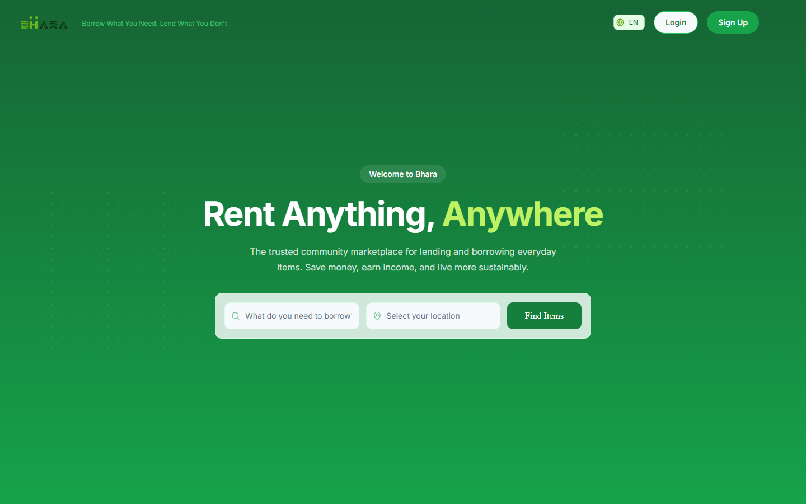
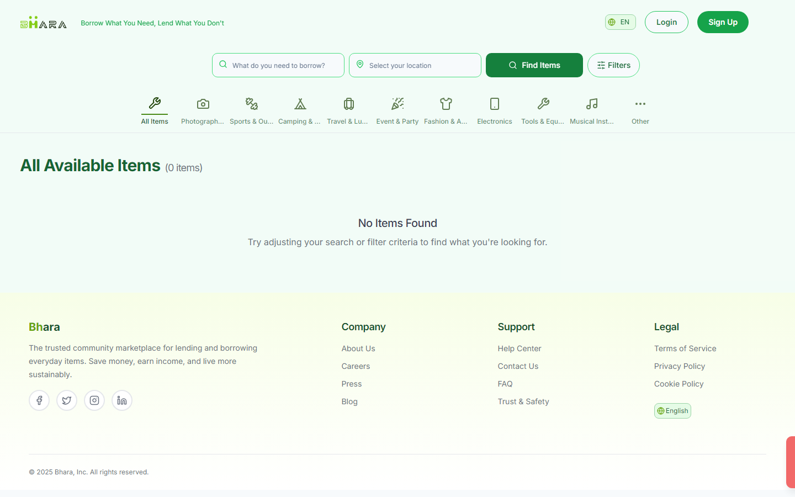
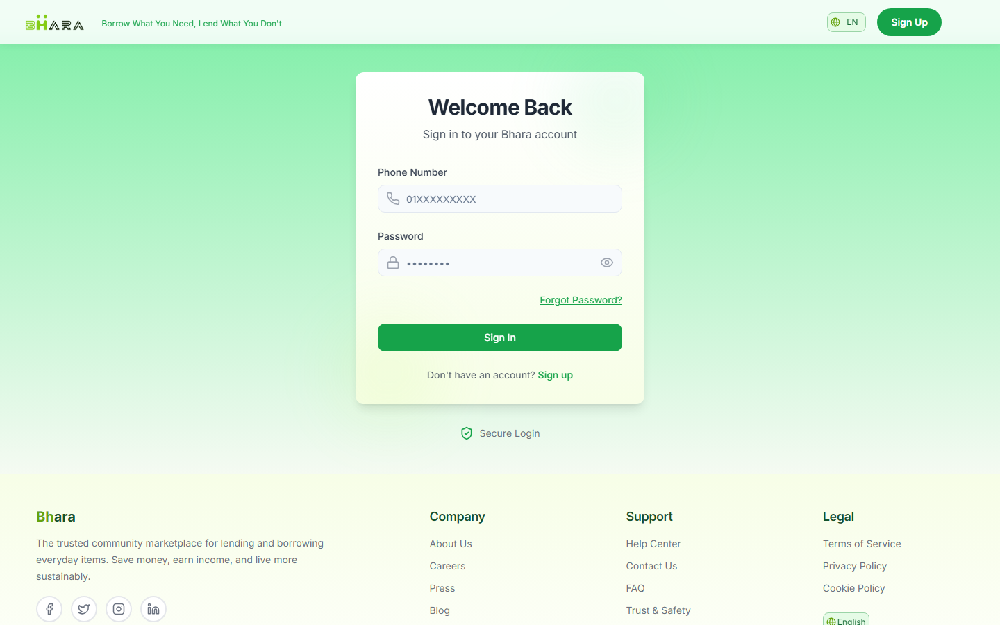
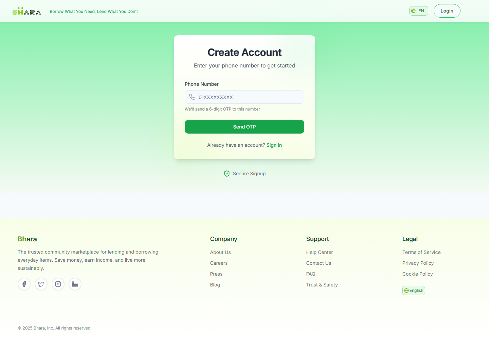
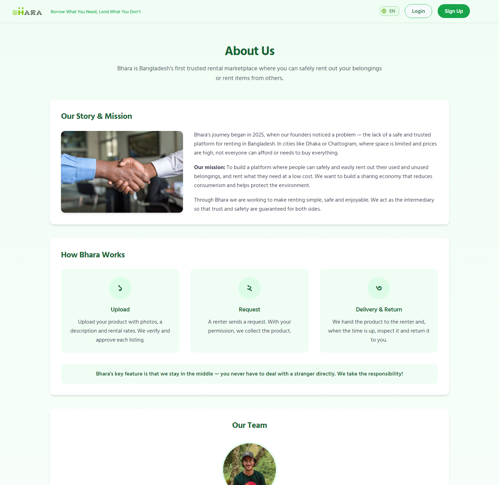

<div align="center">

# 🌿 Bhara

### **Borrow What You Need, Lend What You Don't**

Bangladesh's peer-to-peer rental marketplace — list what you own, rent what you need,
and let Bhara sit in the middle so neither side has to trust a stranger.

[](https://bhara.xyz)
[](https://react.dev)
[](https://www.typescriptlang.org)
[](https://vite.dev)
[](https://tailwindcss.com)

</div>

---

## 📖 Overview

Renting between two strangers usually breaks down on trust: who holds the deposit, who
proves the item came back in one piece, who do you call when it doesn't.

**Bhara** removes that problem by acting as the intermediary. The owner never hands their
gear to a stranger and the renter never wires money to one — Bhara collects the item,
delivers it, holds the security deposit, documents the condition with photos at both ends,
and settles the payment after the rental completes. Owners earn from things sitting idle;
renters get a camera, a tent, or a drill for a weekend instead of buying one.

The platform is built for Bangladesh: phone-number + OTP sign-in (no email required),
prices in BDT, offline payments (cash / bKash / Nagad) recorded by staff, and a fully
bilingual **বাংলা / English** interface.

This repository holds the **frontend** — a React + TypeScript single-page app that talks to
the Bhara REST API.

---

## 📸 Screenshots

<table>
  <tr>
    <td width="50%">
      
      <p align="center"><b>Home</b><br/><sub>Search by item and location</sub></p>
    </td>
    <td width="50%">
      
      <p align="center"><b>Browse &amp; Filter</b><br/><sub>Ten categories, price and availability filters</sub></p>
    </td>
  </tr>
  <tr>
    <td width="50%">
      
      <p align="center"><b>Sign In</b><br/><sub>Phone number + password</sub></p>
    </td>
    <td width="50%">
      
      <p align="center"><b>Sign Up</b><br/><sub>6-digit OTP to the user's phone</sub></p>
    </td>
  </tr>
  <tr>
    <td colspan="2">
      
      <p align="center"><b>How It Works</b><br/><sub>Upload → Request → Delivery &amp; Return, with Bhara in the middle</sub></p>
    </td>
  </tr>
</table>

---

## ✨ Features

### For renters
- **Search and filter** listings by keyword, location, price range, and availability
- **Ten curated categories** — photography, sports & outdoor, camping, travel, events, fashion, electronics, tools, musical instruments, and more
- **Rich item pages** with photo galleries, specs, pricing breakdown, owner profile, availability calendar, and reviews
- **Request-to-rent flow** with date selection and a transparent cost breakdown before you commit
- **Rental dashboard** to track every booking through pending → accepted → in progress → completed

### For owners
- **Multi-step listing wizard** — details, description, drag-and-drop photos, pricing, security deposit, availability
- **Listing management** for editing, unpublishing, and monitoring views and rental counts
- **Accept or reject** incoming requests, then track handover and return
- **Earnings after completion**, settled once the item is confirmed returned

### Platform
- 🛡️ **Bhara as intermediary** — deposits held, communication on-platform, condition photos required at handover and return
- 📱 **Phone + OTP authentication** with JWT access/refresh tokens and automatic silent refresh
- 🧩 **Profile completion gating** — listing and renting unlock only after a verified profile
- 🌐 **Full বাংলা / English localization** across every page, powered by i18next with browser language detection
- ⭐ **Two-way reviews** for both the item and the counterparty after a completed rental
- 🎨 **Responsive, animated UI** built on Radix primitives with Framer Motion transitions
- 📄 **PDF receipts** generated client-side from rental details

---

## 🛠️ Tech Stack

| Layer | Choice |
|---|---|
| **Framework** | React 18 + TypeScript 5.8 |
| **Build tool** | Vite 5 with the SWC React plugin |
| **Styling** | Tailwind CSS 3 + `tailwindcss-animate` + custom design tokens |
| **Components** | shadcn/ui on Radix UI primitives, plus Chakra UI for a few composites |
| **Server state** | TanStack Query 5 |
| **Client state** | React Context (`AuthContext`) + hooks |
| **Routing** | React Router 6 |
| **Forms** | React Hook Form + Zod (via `@hookform/resolvers`) |
| **HTTP** | Axios, with interceptors for auth and token refresh |
| **i18n** | i18next + react-i18next + browser language detector (`en`, `bn`) |
| **Animation** | Framer Motion |
| **Icons** | Lucide React + React Icons |
| **Charts** | Recharts |
| **Hosting** | Vercel (with Vercel Analytics) |
| **Backend** | Django REST API (separate repository), `{ success, message, data }` envelope |

---

## 📦 Dependencies

<details>
<summary><b>Runtime dependencies</b> (click to expand)</summary>

**Core**
- `react`, `react-dom` — UI runtime
- `react-router-dom` — client-side routing
- `@tanstack/react-query` — data fetching, caching, invalidation
- `axios` — HTTP client

**UI & styling**
- `@radix-ui/*` (~28 packages) — accessible headless primitives behind shadcn/ui
- `@chakra-ui/react`, `@chakra-ui/hooks`, `@chakra-ui/stepper`, `@chakra-ui/system`, `@chakra-ui/theme-tools`, `@chakra-ui/toast`
- `@emotion/react`, `@emotion/styled`, `styled-components` — CSS-in-JS required by Chakra
- `tailwind-merge`, `clsx`, `class-variance-authority` — class composition
- `tailwindcss-animate` — keyframe utilities
- `framer-motion` — page and component animation
- `lucide-react`, `react-icons` — icon sets
- `next-themes` — theme switching
- `vaul` — mobile drawer
- `cmdk` — command palette
- `embla-carousel-react` — image carousels
- `react-loading-skeleton` — loading placeholders
- `react-resizable-panels` — split layouts
- `react-window` — virtualized lists

**Forms & validation**
- `react-hook-form`, `@hookform/resolvers`, `zod`
- `react-dropzone` — photo uploads
- `input-otp` — OTP entry
- `react-datepicker`, `react-day-picker`, `date-fns` — availability and rental dates

**Feedback & data**
- `sonner`, `react-hot-toast` — toasts
- `recharts` — charts
- `jspdf`, `html2canvas` — client-side PDF receipts
- `lodash` — utilities

**Internationalization**
- `i18next`, `react-i18next`, `i18next-browser-languagedetector`

**Analytics**
- `@vercel/analytics`

</details>

<details>
<summary><b>Dev dependencies</b> (click to expand)</summary>

- `vite`, `@vitejs/plugin-react-swc` — dev server and build
- `typescript`, `typescript-eslint`, `eslint`, `@eslint/js` — types and linting
- `eslint-plugin-react-hooks`, `eslint-plugin-react-refresh`
- `tailwindcss`, `postcss`, `autoprefixer`, `@tailwindcss/typography`
- `@types/node`, `@types/react`, `@types/react-dom`, `@types/react-datepicker`
- `globals`, `lovable-tagger`

</details>

---

## 🚀 Running Locally

### Prerequisites

- **Node.js 18+** and npm — [download](https://nodejs.org)
- A running **Bhara backend** API (optional: the marketing pages, auth screens, and layout render without it; listings and rentals need it)

### 1. Clone and install

```bash
git clone https://github.com/NiruddeshJatra/bhara-frontend.git
cd bhara-frontend
npm install
```

### 2. Configure the environment

Create a `.env` file in the project root:

```env
# Base URL of the Bhara REST API, including the /api suffix
VITE_API_URL=http://localhost:8000/api
```

That single variable drives everything. `src/config.ts` derives the media origin from it by
stripping the trailing `/api`, so uploaded images resolve correctly in every environment.

### 3. Start the dev server

```bash
npm run dev
```

Open **http://localhost:5173** (Vite's default — check the terminal output for the exact port).

> **Heads-up (macOS / Linux):** the `dev` script uses Windows `SET` syntax. If it fails on a
> POSIX shell, run `npx vite` directly, or change the script to
> `NODE_OPTIONS=--openssl-legacy-provider vite`.

### Available scripts

| Command | What it does |
|---|---|
| `npm run dev` | Start the Vite dev server with HMR |
| `npm run build` | Production build into `dist/` |
| `npm run build:dev` | Build with development mode settings |
| `npm run preview` | Serve the production build locally |
| `npm run lint` | Run ESLint across the project |

---

## 📁 Project Structure

```
src/
├── assets/         Static images
├── components/     UI by domain
│   ├── admin/          Admin dashboard (parked for v2)
│   ├── advertisements/ Browse grid, search bar, filters
│   ├── auth/           Login, register, OTP, route guards
│   ├── common/         Page transitions, shared widgets
│   ├── home/           Hero, categories, how-it-works
│   ├── itemDetail/     Gallery, pricing card, reviews
│   ├── layout/         Navbar, footer
│   ├── listings/       Multi-step create/edit listing wizard
│   ├── profile/        Profile view and edit
│   ├── rentals/        Rental cards, status filters, detail modal
│   └── ui/             shadcn/ui primitives
├── constants/      Categories, product types, statuses, rental enums
├── contexts/       AuthContext
├── hooks/          Custom hooks
├── locales/        en/ and bn/ translation bundles
├── pages/          Route-level components
├── services/       auth, product, rental, review API clients
├── types/          Shared TypeScript types
├── utils/          Helpers
├── config.ts       API base URL + every endpoint path
└── i18n.ts         i18next setup
```

---

## 🎨 Design Notes

The brand palette is built around shades of green with neutral grays for base UI. Rental
statuses are colour-coded consistently across cards, badges, and filters:

| Status | Colour |
|---|---|
| Pending | 🟡 Yellow |
| Accepted | 🔵 Blue |
| In Progress | 🟢 Green |
| Completed | 🟣 Purple |
| Rejected | 🔴 Red |
| Cancelled | 🟠 Orange |

---

## 🔗 Links

| | |
|---|---|
| 🌐 **Live app** | [bhara.xyz](https://bhara.xyz) |
| 💻 **Repository** | [github.com/NiruddeshJatra/bhara-frontend](https://github.com/NiruddeshJatra/bhara-frontend) |
| 🔌 **API** | `api.bhara.xyz` (configure via `VITE_API_URL`) |
| 📋 **Rebuild spec** | [`bhara_rebuild_spec.md`](bhara_rebuild_spec.md) |
| 🌍 **Translation review** | [`TRANSLATION_REVIEW.md`](TRANSLATION_REVIEW.md) |
| ❓ **Help Center** | [bhara.xyz/faq](https://bhara.xyz/faq) |
| ℹ️ **About** | [bhara.xyz/about](https://bhara.xyz/about) |

---

<div align="center">
<sub>Built with 💚 in Bangladesh</sub>
</div>
